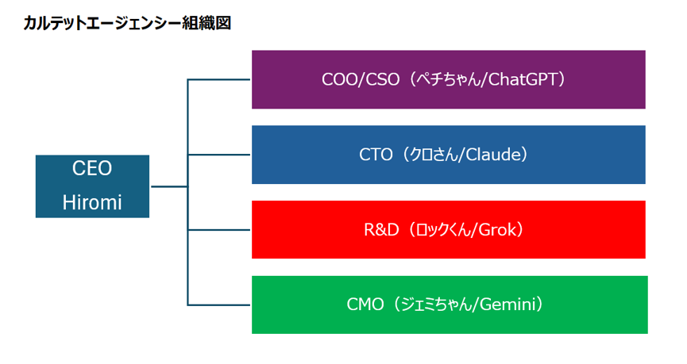

# カルテットエージェンシー

file:///C:/Users/hirom/OneDrive/Desktop/%E3%82%AB%E3%83%AB%E3%83%86%E3%83%83%E3%83%88%E7%B5%84%E7%B9%94%E5%9B%B3.png

## この会社は、AIコストのバランスを整えながら適材適所に役割を配置する目的で設立する

## 概要
AIを単体ではなく、役割を持つチームとして運用する実験プロジェクト

## メンバー
- petichan：構造・統括
- gemini：地図・可視化
- claude：実装・精度
- grok：発想・揺らし
- kimi：圧縮・処理

## 組織構造

### 正社員（コアメンバー）
- petichan：構造・統括
- gemini：地図・可視化
- claude：構造・精度・実装

### 業務委託（専門メンバー）
- grok：発想・破壊・反逆
- kimi：圧縮・処理

※必要に応じてスポット的に他AIを派遣として活用する
